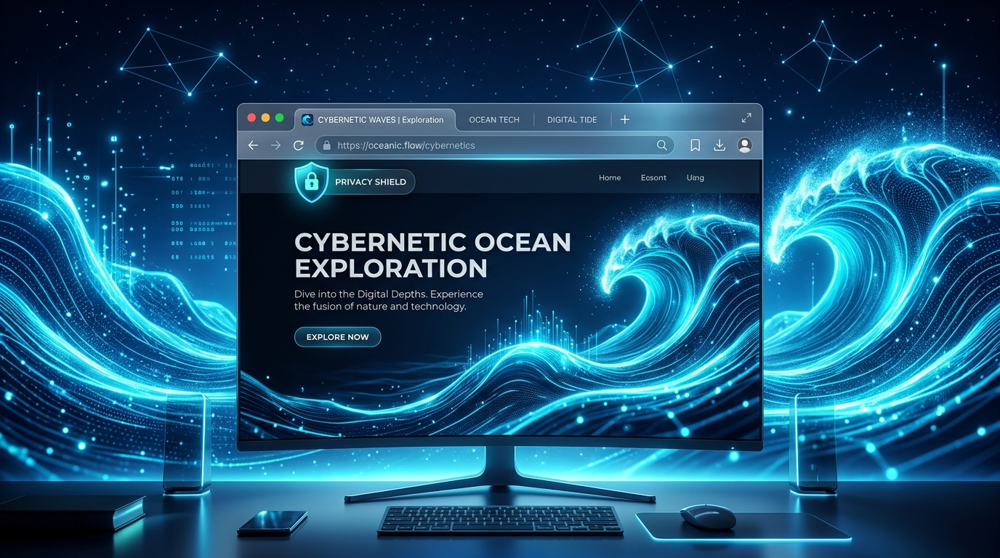
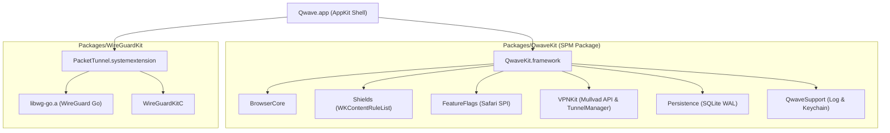

# 🌊 Qwave — Sovereign WebKit-Native macOS Browser Engine

[](https://github.com/peterlodri-sec/qwave/actions/workflows/ci.yml)
[](https://github.com/peterlodri-sec/qwave/releases/tag/v0.1.0)
[](LICENSE)
[](https://apple.com)
[](https://swift.org)
[](https://apple.com/mac)



**Qwave** is a high-performance, WebKit-native, battery-optimized sovereign macOS web browser. It combines **Firefox-style Container Universes**, **Brave-style Content Blocking**, **Tab Hibernation Memory Management**, **Safari SPI Feature Toggles**, and **Mullvad WireGuard VPN Integration**.

Built with modern **Swift 5.10**, **XcodeGen**, and **SPM Modular Architecture**.

---

## ⚡ Key Features

* 🪐 **Firefox Container Isolation**: Per-container isolated `WKWebsiteDataStore(forIdentifier:)` contexts and ephemeral non-persistent burner tabs.
* 🛡️ **Brave Content Shields**: Curated 51-rule `WKContentRuleList` engine, per-host JavaScript toggles, and HTTPS-First upgrader.
* 🔋 **Energy Governor**: `TabHibernator` memory manager that unloads background WebKit processes while preserving tab state and scroll position.
* 🎛️ **Safari SPI Feature Flags**: Safe `responds(to:)`-guarded reflection exposing 100+ Safari Technology Preview experimental feature flags (`_WKFeature`).
* 🔒 **Mullvad VPN Integration (Stage A)**: WireGuardKit system extension (`PacketTunnel.systemextension`) architecture using `NETunnelProviderManager`.
* 💾 **Raw SQLite Storage**: Fast WAL-mode SQLite database engine for browser history, bookmarks, and persistent session restoration.

---

## 🏗️ Architecture Overview



### Module map

`Packages/QwaveKit` ships six targets. Dependencies flow strictly downward — `QwaveSupport` depends on nothing, and nothing depends on `QwaveApp`.

| Module | Depends on | Responsibility |
|--------|-----------|----------------|
| **QwaveSupport** | — | `Log`, `SecretStore` (Keychain). The leaf every module trusts. |
| **Persistence** | QwaveSupport | `SQLiteDatabase` (WAL) + `History`, `Bookmark`, `Session`, `Settings` stores. |
| **Shields** | QwaveSupport, Persistence | `RuleListCompiler`, `ShieldsDirector`, `ShieldsPolicy`, `HTTPSFirstUpgrader`, `BlocklistUpdater`. |
| **FeatureFlags** | QwaveSupport | `_WKFeature` reflection behind `FeatureFlagSafety` guards. |
| **BrowserCore** | QwaveSupport, Persistence, Shields, FeatureFlags | Tabs, containers, navigation, hibernation, downloads, omnibox, find-in-page. |
| **VPNKit** | QwaveSupport | Mullvad API client, relay selection, device keys, tunnel configuration. |

Two products are exposed: **`QwaveKit`** (all six modules, linked by the app) and **`QwaveTunnelKit`** (`VPNKit` + `QwaveSupport` only, linked by the system extension — the tunnel never links the browser).

### Repository layout

```
qwave/
├── project.yml                  # ← single source of truth; Qwave.xcodeproj is generated
├── AGENTS.md                    # build rules & control stance
├── Sources/
│   ├── QwaveApp/                # AppKit shell + SwiftUI settings panes
│   │   └── SettingsWindow/      # Shields · FeatureFlags · VPN · Containers panes
│   └── PacketTunnel/            # NEPacketTunnelProvider system extension
├── Packages/
│   ├── QwaveKit/                # the six modules above + six test targets
│   └── WireGuardKit/            # pinned upstream WireGuard for Apple platforms
├── research/                    # ← Apple Silicon / Swift package research (see below)
└── docs/                        # ARCHITECTURE.md · SIGNING.md · VPN_STAGE_B.md
```

---

## 🚀 Quick Start & Building Locally

### Prerequisites
- macOS 14.0 or newer (Apple Silicon)
- Xcode 15.3+ / Xcode 16+
- [XcodeGen](https://github.com/yonaskolb/XcodeGen) (`brew install xcodegen`)
- [xcbeautify](https://github.com/cpforge/xcbeautify) (`brew install xcbeautify`)

### 1. Run SPM Unit Tests
```bash
swift test --package-path Packages/QwaveKit
```

### 2. Generate Xcode Project & Build
```bash
# Generate Qwave.xcodeproj from project.yml
xcodegen generate --spec project.yml

# Build Release unsigned bundle
xcodebuild \
  -project Qwave.xcodeproj \
  -scheme Qwave \
  -configuration Release \
  -destination 'platform=macOS' \
  CODE_SIGNING_ALLOWED=NO \
  CODE_SIGN_IDENTITY= \
  build | xcbeautify
```

### Development rules

These are enforced conventions, not preferences — see [AGENTS.md](AGENTS.md) for the full set.

1. **Never hand-edit `.xcodeproj`.** It is gitignored and regenerated. Change `project.yml` and run `xcodegen generate --spec project.yml`.
2. **Run SPM tests from the package path**, not from the repository root.
3. **The WireGuard pin moves only with a reviewed diff** and a passing end-to-end tunnel test — never as part of a routine dependency bump.

---

## 🔬 Research

The [`research/`](research/) folder holds a structured evaluation of bleeding-edge **Apple Silicon / Swift** packages, organised **per category** and **per package**, scoped to what this browser actually needs. Every note carries a fact table, an Apple Silicon section, an adoption sketch, risks, and an **Adopt / Trial / Assess / Hold** verdict.

📄 **[research/DIGEST.md](research/DIGEST.md) consolidates the whole folder into one document** — findings, phased action sequence, full verdict matrix, cross-cutting themes, per-category deep research, and open questions. Start there for the complete picture; the per-package notes below are for when you are about to act on a specific one.

**[research/PLATFORM-BASELINE.md](research/PLATFORM-BASELINE.md)** records the macOS, toolchain, and silicon floor everything else assumes.

| # | Category | Focus |
|---|----------|-------|
| 01 | [WebKit & Browser Engine](research/01-webkit-browser-engine/) | Rendering, URL semantics, content blocking |
| 02 | [On-Device AI & ML](research/02-on-device-ai/) | Local inference on the Neural Accelerators |
| 03 | [GPU, Metal & Compute](research/03-gpu-metal-compute/) | Metal 4, tensors, image pipelines |
| 04 | [Concurrency & Runtime](research/04-concurrency-runtime/) | Swift 6.x concurrency, data structures |
| 05 | [Persistence & Data](research/05-persistence-data/) | SQLite, type-safe SQL, observation |
| 06 | [Networking & Protocols](research/06-networking/) | NIO, HTTP types, async clients |
| 07 | [Security, Crypto & VPN](research/07-security-crypto-vpn/) | CryptoKit parity, X.509, WireGuard |
| 08 | [UI: AppKit & SwiftUI](research/08-ui-appkit-swiftui/) | Shell chrome, shortcuts, preferences |
| 09 | [Build & Tooling](research/09-build-tooling/) | Project generation, lint, format, dead code |
| 10 | [Testing & Quality](research/10-testing-quality/) | Swift Testing, snapshots |
| 11 | [Performance & Energy](research/11-performance-energy/) | Benchmarking the Energy Governor |
| 12 | [Distribution & Updates](research/12-distribution-updates/) | Signed auto-update delivery |

### Headline findings

* 🔑 **Code signing is the highest-leverage work available.** Unsigned distribution is the weakest part of a product built on security, *and* the same fix unblocks the VPN — network extensions require a signed, notarised host app. → [Distribution & Updates](research/12-distribution-updates/)
* 🌐 **Foundation `URL` and WebKit disagree about hosts.** IDN, backslash, and embedded-credential cases can shield a page under one identity and load it under another. → [WebURL](research/01-webkit-browser-engine/weburl.md)
* 🧱 **Swift 6.2 "Approachable Concurrency" would simplify the tab lifecycle**, where state crosses isolation boundaries on every hibernate/wake. → [PLATFORM-BASELINE](research/PLATFORM-BASELINE.md)
* 🛡️ **51 rules is a demonstration, not a blocklist.** Build-time conversion from community filter lists scales it with zero new runtime dependencies. → [SafariConverterLib](research/01-webkit-browser-engine/safari-converter-lib.md)
* 📊 **The energy claim is untested.** Hibernation *logic* is covered; memory reclamation is not measured anywhere. → [Performance & Energy](research/11-performance-energy/)
* 🧠 **On-device AI is affordable now** and structurally private — but it must stay optional and `EnergyGovernor`-gated, or it contradicts the product. → [On-Device AI](research/02-on-device-ai/)

---

## 📌 Project Status

Qwave is **v0.1.0** — an architecturally complete first release with real, tested subsystems and known gaps. What that means concretely:

| Area | State |
|------|-------|
| Browser core, shields, containers, persistence | Implemented, unit-tested across all six modules |
| VPN | **Stage A** — architecture and API client in place; see [docs/VPN_STAGE_B.md](docs/VPN_STAGE_B.md) |
| Distribution | **Unsigned** zip builds only; see [docs/SIGNING.md](docs/SIGNING.md) |
| Auto-update | Not implemented — blocked on signing |
| Integration tests against live `WKWebView` | Not implemented; all tests are unit-level against mocks and fixtures |

Unsigned builds require bypassing Gatekeeper to run, and the VPN system extension cannot be fully approved by macOS without a signed, notarised host app.

---

## 📦 Releases

Download pre-compiled unsigned `Qwave.app` builds directly from [GitHub Releases](https://github.com/peterlodri-sec/qwave/releases).

---

## 📜 License

MIT License. Copyright (c) 2026 8b.is / Peter Lodri. See [LICENSE](LICENSE) for details.

---

*qwave · best-of-three macOS browser · 8b.is*
