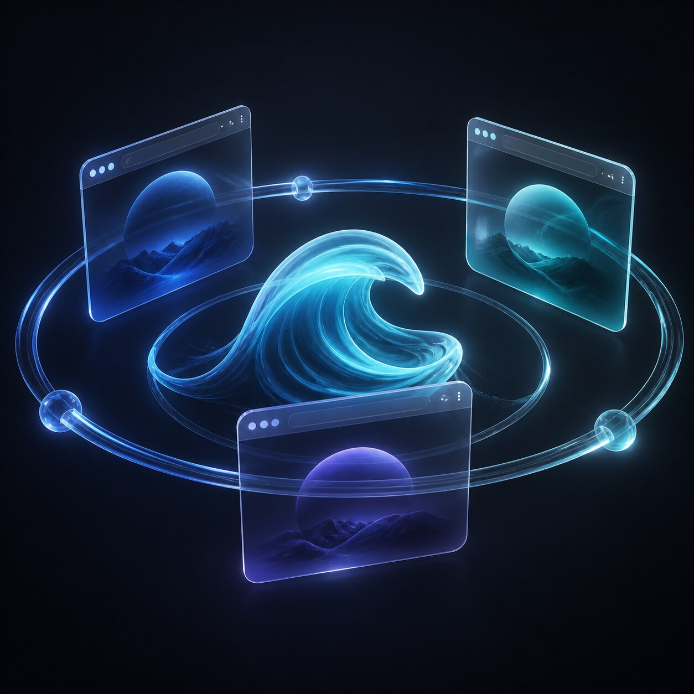
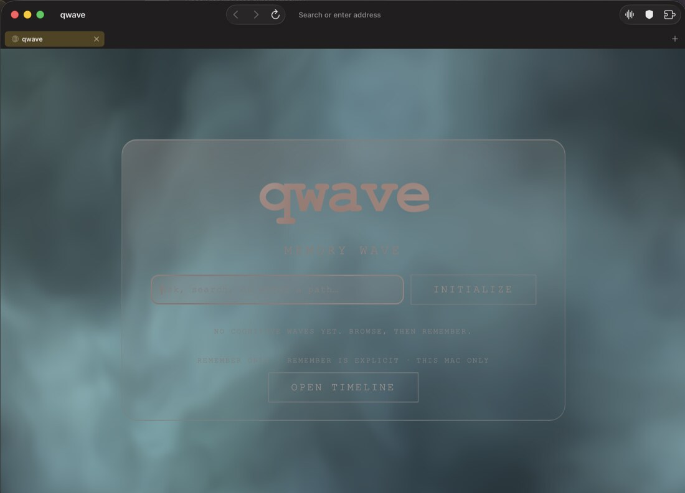

# Qwave — a browser that proves what it sends

[](https://github.com/8b-is/qwave/actions/workflows/ci.yml)
[](https://apple.com)
[](https://swift.org)
[](LICENSE)


Qwave is an open-source, WebKit-native macOS browser for people who want
stronger boundaries around browsing data without giving up the system engine.
It combines per-container storage universes, native content shields, tab
hibernation, an optional Mullvad WireGuard tunnel, a post-quantum negotiation
path, an on-device page summarizer, and an egress allowlist that makes Qwave's
own network activity auditable.

> Qwave is privacy-oriented software, not a promise of anonymity. Read the
> [threat model](SECURITY.md) and the [network inventory](docs/NETWORK.md).

## What makes it different

- **Container universes** — each profile gets its own WebKit data store;
  ephemeral tabs use non-persistent storage and are never restored.
- **Native shields & MV3 DNR** — EasyList/uBlock rules compiled to native WebKit
  C++ content rules at sub-millisecond speeds with per-host JavaScript controls.
- **Apple Silicon UMA SQLite** — 256MB zero-copy `mmap_size`, WAL mode, 64MB cache,
  and 4 P-core sorting threads for instant URL completions and history search.
- **Persistent FaviconStore** — container-isolated SQLite BLOB caching for instant
  favicon rendering with zero cross-container telemetry leakage.
- **On-device omnibox** — suggestions from local history, bookmarks, open tabs, and
  actions, ranked on every keystroke. Network search suggestions are opt-in and off
  by default, so keystrokes never leave the Mac unless you turn them on.
- **Energy-aware tabs** — background WebKit views can be hibernated while tab
  state, history, and scroll position remain restorable.
- **Optional VPN** — Mullvad relay discovery and WireGuard live in a dedicated
  Network Extension; quantum-resistant PSK negotiation fails closed when enabled.
- **MemoryWave** — container-scoped encrypted memory storage with opt-in,
  AI-agnostic inference providers. Stored memory **bodies** never reach a
  remote provider: `WaveDirector` attaches recalled memories only when the
  provider is on-device (`WaveDirector.swift:338`), and `MemoryWavePolicy.decide`
  denies a remote request that *declares* it carries them
  (`.deny(.cognitiveEgress)`, `MemoryWavePolicy.swift:81-82`) — a
  declared-intent gate plus a caller-side guard, not a filter on the outgoing
  prompt. One carve-out: a **timeline summary** with a remote provider sends the
  title, time, and host of every record in the window, and no snippets
  (`WaveDirector.swift:153-154`, `MemoryTimeline.swift:63-79`). Pages you
  explicitly summarise or ask about *are* sent to the provider you configured;
  see [docs/NETWORK.md](docs/NETWORK.md).
- **Summarize** — on-device page summarization via Apple's FoundationModels.
  No streaming, no network, no model output that can act on the browser.
- **AutoFill** — passwords and passkeys through an `ASCredentialProvider` extension
  and WebAuthn, kept in the OS / iCloud keychain and deliberately separate from the
  post-quantum / `DeviceKeyManager` stack.
- **Spaces** — the container universes surface as first-class Spaces with a vertical
  tab sidebar; a system Focus filter can switch the active Space and tighten shields.

## How it works — concept diagrams

### Container isolation



Each profile owns a persistent `WKWebsiteDataStore`; burner tabs get a
non-persistent store and leave nothing behind. See
[`ContainerRegistry`](Packages/QwaveKit/Sources/BrowserCore/ContainerRegistry.swift),
[`WebViewFactory`](Packages/QwaveKit/Sources/BrowserCore/WebViewFactory.swift).

```text
               ┌───────────────────────────────────────────────┐
               │                  Qwave.app                    │
               │                                               │
 profile A ───▶│ WKWebsiteDataStore(.persistent)  cookies,     │
               │   └─ tabs A1…An                localStorage,  │
               │                              IndexedDB,       │
 profile B ───▶│ WKWebsiteDataStore(.persistent)  service      │
               │   └─ tabs B1…Bm                 workers       │
               │                              ─────────────    │
 burner tab ──▶│ WKWebsiteDataStore(.nonPersistent)            │
               │   └─ closed ⇒ gone, never restored           │
               └───────────────────────────────────────────────┘
```

### Shields pipeline


The blocklist ships as a committed snapshot (zero launch egress), compiles to
`WKContentRuleList`, and navigation waits for it. See
[`ShieldsDirector`](Packages/QwaveKit/Sources/Shields/ShieldsDirector.swift),
[`UBORuleListCompiler`](Packages/QwaveKit/Sources/Shields/UBORuleListCompiler.swift),
[docs/BLOCKLIST.md](docs/BLOCKLIST.md).

```text
 blocklist.json ──(committed snapshot, scripts/update-blocklist.sh)──┐
      │                                                              │
      ▼                                                              │
 UBOFilterParser ──▶ UBORuleListCompiler ──▶ WKContentRuleList       │
      │                                          │                  │
      ▼                                          ▼                  │
 per-site toggles ◀── ShieldsDirector ◀── applyListsThen(to:)       │
      │                                          │                  │
      ▼                                          ▼                  │
 HTTPSFirstUpgrader                NavigationCoordinator gates the   │
                                   first navigation on shields       │
                                   .whenReady() — never bypassed ───┘
```

### Energy governor and hibernation

A pure conditions → tier → policy mapping; memory pressure demotes the tier
before anything is decided. See
[`EnergyGovernor`](Packages/QwaveKit/Sources/BrowserCore/EnergyGovernor.swift),
[`TabHibernator`](Packages/QwaveKit/Sources/BrowserCore/TabHibernator.swift),
[docs/ENERGY.md](docs/ENERGY.md), [docs/PERF.md](docs/PERF.md).

```text
 thermal .nominal ─┐
 lowPower off ─────┼──▶ tier .normal   ──▶ tabs alive, AI allowed
 occlusion false ──┘
                      underMemoryPressure ──▶ tier .conserve / .critical
                                                      │
                                                      ▼
                                     hibernate background tabs,
                                     pause/suspend media,
                                     quietly defer AI inference
```

### Summarize (on-device AI)

Explicit command only: extract, generate, render inert text. See
[`SummarizeSession`](Packages/QwaveKit/Sources/Summarize/SummarizeSession.swift),
[docs/SUMMARIZE.md](docs/SUMMARIZE.md),
[`readability-probe`](research/02-on-device-ai/readability-probe/),
[`foundation-models-probe`](research/02-on-device-ai/foundation-models-probe/).

```text
 ⌥⌘S / toolbar ──▶ available?  macOS 26 + Apple Silicon + Apple Intelligence
        │              │
        │              ├─ modelNotReady ──▶ re-check on foreground (self-heals)
        │              └─ otherwise ─────▶ vanish cleanly, no grey-out, no nag
        ▼
 energy tier == .normal? ── no ──▶ quietly absent this moment
        │ yes
        ▼
 extractor.js (F1 1.00 ×4, 0.96 docs) ──▶ LanguageModelSession.respond
        │                                     respond-only: the stream path
        │                                     refuses this workload on 26.4
        │                                     retry ≤ 3 on nondeterministic
        ▼                                     refusals; neutral failure text
 inert selectable text panel ◀── nothing downstream of the model acts;
                                 zero network egress
```

### VPN and post-quantum path


Mullvad discovery, WireGuard in a Network Extension, and a PSK negotiated with
a hybrid post-quantum KEM. See
[`VPNKit`](Packages/QwaveKit/Sources/VPNKit/),
[`PostQuantum`](Packages/QwaveKit/Sources/PostQuantum/),
[docs/VPN_STAGE_B.md](docs/VPN_STAGE_B.md), [docs/CRYPTO_REVIEW.md](docs/CRYPTO_REVIEW.md).

```text
 Qwave.app ──▶ Mullvad relay discovery ──▶ WireGuard handshake
      │                                        │
      └── PSK via ML-KEM-768 KEM ──────────────┘
          (FIPS 203; fails closed: no PQ-negotiated PSK ⇒ no tunnel)

 PacketTunnel.systemextension  (Network Extension, WireGuardKit)
```

### MemoryWave

Container-scoped, encrypted memory substrate with an explicit provider seam —
local by default, remote only when configured. See
[`MemoryProvider`](Packages/QwaveKit/Sources/MemoryWave/MemoryProvider.swift),
[`MemoryStore`](Packages/QwaveKit/Sources/MemoryWave/MemoryStore.swift).

```text
 page text ─▶ ArticleExtractor ─▶ MEM8 store (container-scoped, encrypted)
      ▲                                    │
      └──────── MemoryProviding ◀──────────┘
               default: NullMemoryProvider  (no inference configured)
               optional: OpenAI-compatible  (explicit HTTPS endpoint only)
```

### Egress audit

Qwave's own egress is held to a committed allowlist, and — since
[#77](https://github.com/8b-is/qwave/issues/77) — `EgressGuard`, a
`URLProtocol` wired into every fixed-host client, checks it at runtime instead
of only in review. The shields launch path is separately asserted
request-free by a test whose reach is bounded (caveats below). See
[`EgressAllowlist`](Packages/QwaveKit/Sources/QwaveSupport/EgressAllowlist.swift),
[`EgressGuard`](Packages/QwaveKit/Sources/QwaveSupport/EgressGuard.swift),
[docs/NETWORK.md](docs/NETWORK.md).

```text
 any wired Qwave network client
      │
      ▼
 EgressGuard (URLProtocol) ── checks EgressAllowlist.permits(host:)
      │                        allowed → steps aside, request proceeds
      │                        blocked → fails the request, logs, records
      ▼
 allowlisted hosts (4): github.com          Sparkle appcast
                        api.mullvad.net     VPN control API
                        api.x.ai            default remote AI endpoint
                        duckduckgo.com      omnibox suggestions (opt-in)
      │
      ▼
 launch path ── EgressGuardTests URLProtocol recorder ──▶ zero requests
                (no launch-time blocklist fetch since 0.4.4)
```

Two honest caveats remain. `EgressGuard` only reaches a client that installs
it: a default- or shared-configuration session gets it for free from the
process-wide `URLProtocol.registerClass` in `main.swift`, but a
custom-configuration session (ephemeral, pinned, etc.) has to call
`EgressGuard.install(into:)` explicitly — `URLSession.mullvadPinned()` and
`DuckDuckGoSuggestionProvider` do; a new fixed-host client that skips this
would not be caught here, only by review. And some Category-A clients are
deliberately **not** gated by `EgressGuard` at all, because their destination
isn't a fixed host by design — Memory Wave's user-configurable endpoint
(guarded instead by `EndpointRedirectPolicy` and `MemoryWavePolicy`),
`FaviconLoader`, and remote-markdown fetches are all page- or
user-driven. The shields launch-path assertion is the one thing here checked
dynamically rather than by review of the wiring itself: it registers a
`URLProtocol` recorder over the shields launch path and asserts nothing was
requested; the test builds its own `ShieldsDirector` rather than running the
app's launch sequence, and WebKit's own network process (Category C) is
invisible to any `URLProtocol`-based check, `EgressGuard` included.

## Architecture at a glance



```text
Qwave.app                         AppKit shell + SwiftUI settings
├── QwaveKit                      local Swift package, Swift 6 language mode
│   ├── BrowserCore                tabs, containers, navigation, hibernation
│   ├── Shields                    content rules and HTTPS-First
│   ├── Persistence                actor-isolated SQLite stores
│   ├── MemoryWave                 encrypted MEM8 memory substrate
│   ├── Summarize                  on-device page summarization (macOS 26+)
│   ├── VPNKit                     Mullvad API, tunnel lifecycle, PQ seam
│   ├── PostQuantum                 Keccak, ML-KEM-768, hybrid (PQ+classical) KEM
│   ├── WebExtensions               MV3 registry and browser.* bridge
│   ├── URLIdentity                 WHATWG/WebKit-compatible host identity
│   ├── FeatureFlags                guarded WebKit SPI feature access
│   ├── WebCredentials              keychain-only passwords + passkeys (AutoFill)
│   └── QwaveSupport                logging, keychain, egress guard
└── PacketTunnel.systemextension    WireGuardKit + NetworkExtension boundary
```

Dependency direction is one-way (app → QwaveKit; feature modules never reach
into the AppKit shell) — see [docs/ARCHITECTURE.md](docs/ARCHITECTURE.md) for
the exact graph, isolation rules, data flow, and test boundaries.

## Module map

- **BrowserCore** — the convergence point: tabs, containers, navigation,
  hibernation. Key types: `TabManager`, `ContainerRegistry`, `TabHibernator`,
  `EnergyGovernor`, `NavigationCoordinator`, `SessionRestorer`, `OmniboxSuggester`.
  [source](Packages/QwaveKit/Sources/BrowserCore/)
- **Shields** — uBO → content-rule compilation, per-site toggles, HTTPS-First.
  Key types: `ShieldsDirector`, `UBORuleListCompiler`, `HTTPSFirstUpgrader`.
  [source](Packages/QwaveKit/Sources/Shields/) · [docs/BLOCKLIST.md](docs/BLOCKLIST.md)
- **Persistence** — actor-isolated SQLite stores. [source](Packages/QwaveKit/Sources/Persistence/)
- **MemoryWave** — encrypted memory substrate. Key types: `MemoryStore`,
  `MemoryProvider` (`MemoryProviding`), `ArticleExtractor`, `WaveInt`.
  [source](Packages/QwaveKit/Sources/MemoryWave/)
- **Summarize** — respond-only FoundationModels wrapper. Key types:
  `SummarizeSession`, `SummarizePolicy`, `ArticleExtractor` (byte-identical
  probe script). [source](Packages/QwaveKit/Sources/Summarize/) · [docs/SUMMARIZE.md](docs/SUMMARIZE.md)
- **VPNKit** — Mullvad API, tunnel lifecycle, PQ PSK seam. [source](Packages/QwaveKit/Sources/VPNKit/)
- **PostQuantum** — Keccak, ML-KEM-768 (official NIST ACVP vectors), hybrid KEM.
  [source](Packages/QwaveKit/Sources/PostQuantum/) · [docs/CRYPTO_REVIEW.md](docs/CRYPTO_REVIEW.md)
- **WebExtensions** — MV3 registry and `browser.*` bridge.
  [source](Packages/QwaveKit/Sources/WebExtensions/)
- **WebCredentials** — keychain-only website logins and passkeys for AutoFill.
  Foundation + Security only; never links the crypto/VPN stack. Key types:
  `WebCredential`, `WebCredentialStore`. [source](Packages/QwaveKit/Sources/WebCredentials/)
- **URLIdentity** — WHATWG/WebKit-compatible host identity (fixes a shielding
  bypass, per `research/collections-foundation/weburl.md`).
  [source](Packages/QwaveKit/Sources/URLIdentity/)
- **FeatureFlags** — guarded `_WKFeature` access with the
  unavailable / emptySurface / available tri-state.
  [source](Packages/QwaveKit/Sources/FeatureFlags/)
- **QwaveSupport** — `QwaveLog` (privacy-classified), keychain, egress allowlist.
  [source](Packages/QwaveKit/Sources/QwaveSupport/)

## Build locally

### Requirements

- macOS 14 or newer
- Xcode 16+ (the package uses Swift 6 language mode)
- [XcodeGen](https://github.com/yonaskolb/XcodeGen)
- Go and Zig for the packet-tunnel pre-build steps

### Package tests

```sh
swift test --package-path Packages/QwaveKit -c release
```

### Generate and build the app

```sh
xcodegen generate --spec project.yml
xcodebuild \
  -project Qwave.xcodeproj \
  -scheme Qwave \
  -configuration Release \
  -destination 'platform=macOS' \
  CODE_SIGNING_ALLOWED=NO \
  CODE_SIGN_IDENTITY= \
  build
```

`project.yml` is the source of truth. Never hand-edit the generated
`Qwave.xcodeproj`. VPN activation requires the signing and entitlement setup in
[docs/SIGNING.md](docs/SIGNING.md). Toolchain pinning lives in
[docs/PINNING.md](docs/PINNING.md).

## Swift 6 engineering rules

- QwaveKit targets use Swift 6 language mode and complete strict concurrency.
- Persistence, MemoryWave, and service state use actors or explicit main-actor
  ownership; cross-boundary values are `Sendable` value types.
- The NetworkExtension provider is a narrow SDK compatibility boundary. Its
  legacy mutable provider surface is documented in [SECURITY.md](SECURITY.md)
  and must not leak into QwaveKit APIs.
- Async WebKit and persistence APIs stay async at their boundary; do not add
  blocking queues or semaphore bridges to silence compiler diagnostics.
- New network clients must update the committed egress allowlist and tests.

## Repository map

```text
Packages/QwaveKit/       Swift package and headless tests
Packages/WireGuardKit/   vendored WireGuard bridge
Sources/QwaveApp/        AppKit shell and SwiftUI panes
Sources/PacketTunnel/    Network Extension provider
Resources/               plists, entitlements, bundled rules
docs/                    architecture, network, signing, design site
research/                evaluated platform/package notes + probes
project.yml              XcodeGen source of truth
```

## Documentation

Product and engineering specs:

- [Architecture](docs/ARCHITECTURE.md) — module graph, isolation, data flow
- [Security policy and threat model](SECURITY.md)
- [What Qwave sends](docs/NETWORK.md) — the network inventory + egress allowlist
- [VPN Stage B](docs/VPN_STAGE_B.md)
- [Summarize design](docs/SUMMARIZE.md) — on-device AI contract
- [Blocklist pipeline](docs/BLOCKLIST.md)
- [Energy measurement](docs/ENERGY.md) · [Performance](docs/PERF.md)
- [Crypto review](docs/CRYPTO_REVIEW.md)
- [Signing and activation](docs/SIGNING.md) · [Releasing](docs/RELEASING.md)
- [Toolchain pinning](docs/PINNING.md) · [Xcode Cloud](docs/XCODE_CLOUD.md)
- [GRDB evaluation](docs/GRDB-EVALUATION.md) · [Roadmap audit](docs/ROADMAP_AUDIT.md)
- [Contributing](CONTRIBUTING.md)
- [Project site](https://8b-is.github.io/qwave/) — design gallery

Research (measured, version-stamped, Qwave-specific):

- [research/README.md](research/README.md) — 41 package notes, 12 categories
- [Platform baseline](research/PLATFORM-BASELINE.md) · [Digest](research/DIGEST.md)
- [Bleeding-edge 2026](research/BLEEDING-EDGE-2026.md)
- WebGPU surface probe (default-on in WKWebView; `WebGPUEnabled` inert):
  [01-webkit-browser-engine/webgpu-surface](research/01-webkit-browser-engine/webgpu-surface/)
- Three-way wave benchmark (CPU / Metal / WebGPU):
  [03-gpu-metal-compute/wave-fbm-benchmark](research/03-gpu-metal-compute/wave-fbm-benchmark/)
- Lock & `~Copyable` benchmark:
  [04-concurrency-runtime/arc-lock-benchmark](research/04-concurrency-runtime/arc-lock-benchmark/)
- Readability extraction probe (F1 measured):
  [02-on-device-ai/readability-probe](research/02-on-device-ai/readability-probe/)
- FoundationModels probe (availability, latency, provider seam):
  [02-on-device-ai/foundation-models-probe](research/02-on-device-ai/foundation-models-probe/)

## Status

Shipped in v1.0.0: the browser core, shields, WebExtensions MV3 bridge,
MemoryWave, Summarize (macOS 26+ on Apple Silicon with Apple Intelligence),
post-quantum KEM implementation, signed release workflow, and Swift 6
concurrency migration — all covered by package tests.

Since 1.0.0: downloads UI, crash-safe session restore, a `qwave://diagnostics`
telemetry page, VoiceOver accessibility on the chrome, on-device semantic memory
recall, a command palette, first-run bookmark import with Spotlight entities,
container-bound Focus filters with a Spaces sidebar, keychain-only AutoFill
(passwords + passkeys), and a zero-egress Safe Browsing host-set (shipped as a
sample list — see [docs/SAFE-BROWSING.md](docs/SAFE-BROWSING.md) for sourcing a
real feed).

The VPN system extension still depends on Apple Network Extension entitlements
for signed distribution (Apple DTS case open); see
[docs/SIGNING.md](docs/SIGNING.md) for the exact gap.

An iPhone port is in progress: the shared QwaveKit package now compiles for iOS
(Phase 0). A SwiftUI app target, iOS AutoFill, and a NetworkExtension VPN are the
following phases.

## License

Qwave is released under the [MIT License](LICENSE). Copyright © 2026 8b.is /
Peter Lodri.
