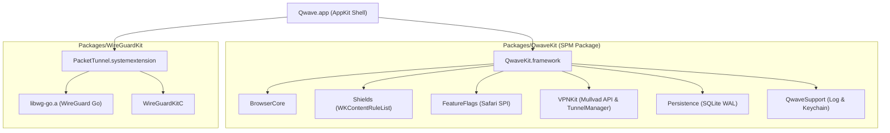

# 🌊 Qwave — Sovereign WebKit-Native macOS Browser Engine

[](https://github.com/peterlodri-sec/qwave/actions/workflows/ci.yml)
[](https://github.com/peterlodri-sec/qwave/releases/tag/v0.1.0)
[](LICENSE)
[](https://apple.com)


**Qwave** is a high-performance, WebKit-native, battery-optimized sovereign macOS web browser. It combines **Firefox-style Container Universes**, **Brave-style Content Blocking**, **Tab Hibernation Memory Management**, **Safari SPI Feature Toggles**, and **Mullvad WireGuard VPN Integration**.

Built with modern **Swift 5.10**, **XcodeGen**, and **SPM Modular Architecture**.

---

## ⚡ Key Features

* 🪐 **Firefox Container Isolation**: Per-container isolated `WKWebsiteDataStore(forIdentifier:)` contexts and ephemeral non-persistent burner tabs.
* 🛡️ **Brave Content Shields**: Curated 51-rule `WKContentRuleList` engine, per-host JavaScript toggles, and HTTPS-First upgrader.
* 🔋 **Energy Governor**: `TabHibernator` memory manager that unloads background WebKit processes while preserving tab state and scroll position.
* 🎛️ **Safari SPI Feature Flags**: Safe `responds(to:)`-guarded reflection exposing 100+ Safari Technology Preview experimental feature flags (`_WKFeature`).
* 🔒 **Mullvad VPN Integration (Stage A)**: WireGuardKit system extension (`PacketTunnel.systemextension`) architecture using `NETunnelProviderManager`.
* 💾 **Raw SQLite Storage**: Fast WAL-mode SQLite database engine for browser history, bookmarks, and persistent session restoration.

---

## 🏗️ Architecture Overview



---

## 🚀 Quick Start & Building Locally

### Prerequisites
- macOS 14.0 or newer
- Xcode 15.3+ / Xcode 16+
- [XcodeGen](https://github.com/yonaskolb/XcodeGen) (`brew install xcodegen`)
- [xcbeautify](https://github.com/cpforge/xcbeautify) (`brew install xcbeautify`)

### 1. Run SPM Unit Tests
```bash
swift test --package-path Packages/QwaveKit
```

### 2. Generate Xcode Project & Build
```bash
# Generate Qwave.xcodeproj from project.yml
xcodegen generate --spec project.yml

# Build Release unsigned bundle
xcodebuild \
  -project Qwave.xcodeproj \
  -scheme Qwave \
  -configuration Release \
  -destination 'platform=macOS' \
  CODE_SIGNING_ALLOWED=NO \
  CODE_SIGN_IDENTITY= \
  build | xcbeautify
```

---

## 📦 Releases

Download pre-compiled unsigned `Qwave.app` builds directly from [GitHub Releases](https://github.com/peterlodri-sec/qwave/releases).

---

## 📜 License

MIT License. Copyright (c) 2026 8b.is / Peter Lodri. See [LICENSE](LICENSE) for details.
